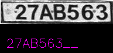

# TIR Plate OCR

This repository provides a solution for Optical Character Recognition (OCR) on TIR plates from trucks in Iran. It leverages a pre-trained model from the [fast-plate-ocr](https://github.com/ankandrew/fast-plate-ocr) repository to recognize and extract text from license plates in images.

## Features

- **Fast and Lightweight**: Utilizes a pre-trained model optimized for speed and accuracy.
- **Easy Integration**: Simple to use with minimal setup required.
- **Batch Processing**: Processes multiple images from the `Transit` folder.

## Prerequisites

- Python 3.x
- OpenCV
- NumPy
- fast-plate-ocr

## Installation

1. Clone the repository:

   ```bash
   git clone https://github.com/salemsajjad/tir-plate-ocr.git
   cd tir-plate-ocr
   ```

2. Install the required packages:

   ```bash
   pip install opencv-python-headless numpy fast-plate-ocr
   ```

## Usage

1. **Initialize the Recognizer**: The script uses the `ONNXPlateRecognizer` from the fast-plate-ocr library.

2. **Process Images**: The script processes each image in the `Transit` folder, performs OCR, and saves the output with the recognized text.

3. **Run the Script**:

   ```bash
   python ocr_test_show.py
   ```

   Each processed image will be saved with the text overlay in the same directory.

## Example

Below is an example of how the OCR results are displayed on the images:





## Acknowledgments

This project uses the [fast-plate-ocr](https://github.com/ankandrew/fast-plate-ocr) library for OCR processing. Special thanks to the contributors of the fast-plate-ocr project for providing a robust and efficient OCR solution.

## License

This project is licensed under the MIT License. See the [LICENSE](LICENSE) file for details.
